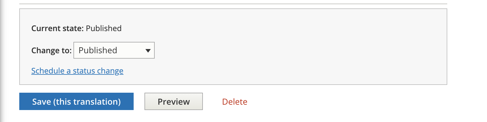
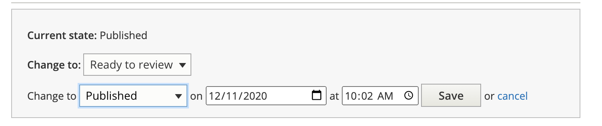

============================
Scheduling Revisions
============================

.. warning::  Scheduling revisions are per-language.  Scheduling a publishing revision for English will have no impact on Spanish or Polish and vice versa. You can create a Spanish revision for example and schedule it for a later date and still continue to make live revisions to Polish and Spanish with no impact.

These instructions apply only to content types subject to moderation:

* legal content
* ADRM content
* Toolbox tool
* Tool steps

It does not apply to portal pages, toolboxes, or any other type of content at this time.

To schedule a revision, at the bottom of the edit form and click on "Schedule a status change"

Set your schedule change

Save your revision

.. note:: Revision scheduling rely on a scheduled task on the back-end that runs approximately once an hour. Revisions may not go live or be taken down at the exact time you entered.

Use Cases
=============

To publish later:

* Change the current status to Ready to Review. This will leave the original published revision as is
* Schedule a change to Published for the date/time you want the revision to take.

.. image .../assets/cms-scheduler-publish.png

