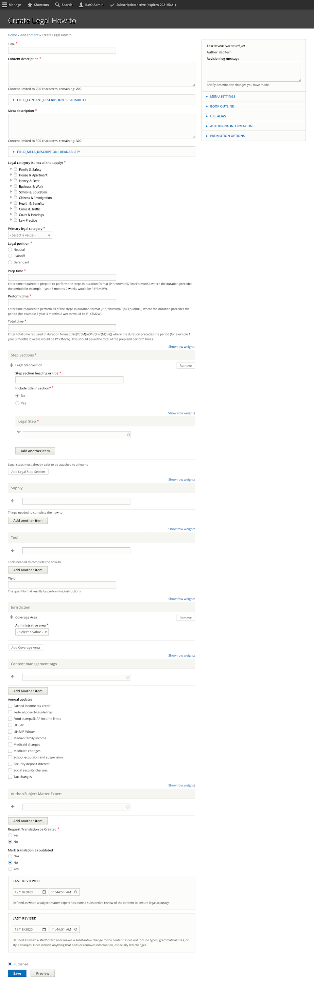

.. _cms-legal-howto:

======================
Legal How-To
======================

A legal how-to is a container for a set of Legal Steps. Legal How-to's are attached to one or more Legal solutions. See the :ref:`cms-legal-solution` documentation.

.. note:: Legal how-tos are not included in site search or drill down. They display within Legal Solution content only.

Creating a legal how-to
==========================

Create the core how-to information
---------------------------------------

* Add a title. The title should match our standard title style for process-oriented legal content.
* Add a disambiguation tag, if applicable, to identify this solution from other similarly titled solutions. For example, if the content title is "Participate in the court case" the disambiguation tag might be "Eviction" or "Foreclosure" to distinguish between the two.
* Provide an alternative name if applicable.
* Add a meta description. This is the description that will be used in social media, search indexes, and in any API. This should be limited to 300 characters.

Categorize the solution
-------------------------

* Tag the legal problem to one or more legal issues. This is used to associate with Get Legal Help tools.
* Select the primary legal category. This is used to keep the information organized when it is tagged to multiple primary categories (for example, we may tag a criminal records issue to Business & Work and Crime & Traffic).
* Select the primary level 2 navigation term. This is used to help with breadcrumbs, reporting, and Guided Navigation. This single term comes from the navigational IA taxonomy.
* Indicate the legal position associated with the how-to

.. note:: Because Legal How-tos are accessible only from DIY Legal solutions/Legal Solution content, we do not tag them to the navigational IA.

Create the How-to content
-----------------------------

* Define the time required to complete the steps in the process. This includes:

  * Prep time.
  * Perform time.
  * Wait time
  * Total time, which should be the sum of the prep, perform, and wait time.

.. note:: We have not as yet been including this information. Given the complexity of legal processes, it may be best to just put an average total time if we include times.

* Define the step sections and link to the steps. Steps can be organized in sections that restart numbering or as a single list of steps.
* Define any tools or supplies one might need to complete the how-to
* Set the jurisdiction for the how-to.

.. note:: Legal steps must exist before they can be added to a how-to. A step may be included in more than one how-to.

Add additional metadata
^^^^^^^^^^^^^^^^^^^^^^^^^^

* Tag the how-to to any annual updates that may need to be reviewed.
* Optionally, add any content management tags
* Indicate whether a translation should be requested.
* Indicate whether an existing translation should be marked as outdated.
* Add the last full review date
* Add the last revised by staff date

Style notes
=============

Times
------------

.. note:: we made these fields not required at this time. We need information from SME to provide this information.

A How-to requires three time entries:

* prep time:  the estimated amount of time it takes to prepare to complete the how-to. This time should the time to prepare the materials used to execute the How-to. This should include the time to:

  * Gather background documents and materials

* perform time:  the estimated amount of time it takes to perform the how-to. This should include time for:

  * Filling out forms
  * Wait time from filing to having a hearing
  * Wait time from having a hearing to resolution

* Total time should be the sum of the prep + perform time.

Time format
-------------

Times use the standard `duration format <https://en.wikipedia.org/wiki/ISO_8601>`_.

Standard format:  P(n)Y(n)M(n)W(n)D(n)T(n)H(n)M(n)S)
P, followed by the number for each:

* Years (Y)
* Months (M)
* Weeks (W)
* Days (D)

T, followed by the number for each:

* Hours (H)
* Minutes (M)
* Seconds (S)

Examples:

* 2 weeks: P2W
* 1 year, 3 months, 6 days: P1Y3M6D
* 3 days, 14 hours, 5 minutes: P3DT14H5M
* 6 hours: PT6H

.. todo:: Help text for duration is missing W(n)D(n).

Step sections
---------------

Step lists can be created in sections. A how-to may have a single linear steps section or may have multiple step sections.

.. note::  An example how-to for washing a car may have a step section labeled

   * "Option 1:  Take it the car washing service"
   * "Option 2:  Hand wash in the driveway."

   Even linear, but complex How-tos may benefit from sections. For example, in applying for unemployment, it may make sense to have a Step section "Determine if you are eligible" with steps of Determine whether the reason you no longer have a job is eligible, determine whether you have sufficient earnings to be eligible.

Each section should have:

* A heading or title. This can be set to display or not display. For how-to's with one step section, this should be set to not display.
* One or more steps. These are entity references to legal step content. The step must be written before it can be included.

Supplies and tools
----------------------

Supplies and tools should be entered one at a time.

A supply is something needed to complete the steps in the how-to. Supply examples might be:

* an ID or driver's license
* a birth certificate
* a marriage license

A tool is something used to complete the steps in the how-to. Tool examples might be:

* a telephone
* a pen
* an email address for e-filing.

Jurisdiction
----------------

Each how-to should be coded to the jurisdiction(s) it applies to. See :ref:`cms-coverage-area`. A :ref:`cms-legal-solution` can have multiple how-tos, each with different jurisdictions. Individual steps may also be tagged by jurisdiction.

Use a narrower jurisdiction than statewide when all of the steps apply to one specific location. Use statewide jurisdiction when all of the steps are statewide or there is a mix of jurisdictions in the steps but the how-to as a whole still applies with the jurisdiction-specific step included.

Examples:

* A how-to has 5 steps. Step 1,2,4,5 apply to everyone in Illinois. Step 3 applies only to Cook county. In this scenario, it is okay to create 1 How-to for Illinois and tag Step 3 to Cook county.

  * The user in Cook County will see steps 1,2,3,4,5
  * The user in all other counties will see steps 1,2,4,5

* A how-to has 5 steps. Steps 1,2,4,5 apply to everyone in Ilinois. There are 3 different step 3s depending on whether the user is in Cook, Kane, or a different county. It is still okay to create 1 how-to and include the 3 separate versions of Step 3.

* Cook county has a completely different process than everywhere else in the state. In this scenario, it is better to create 2 How-tos (one limited to Cook county and one limited to the other 101 counties.

Full add/edit form
====================

