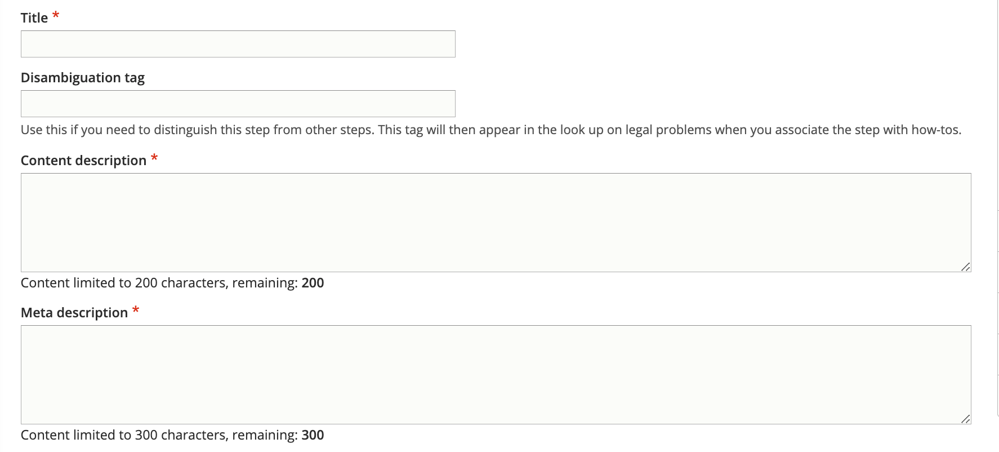

.. _cms-legal-howto:

======================================
Organizing legal steps into a How-to
======================================

A legal how-to is a container for a set of Legal Steps. Legal How-to's are attached to one or more Legal Options. See the :ref:`cms-legal-solution` documentation.

.. note:: Legal how-tos are not included in site search or drill down. They appear only within a Legal Option page.

Create the core how-to information
===================================

* Add a title. The title should match our standard title style for process-oriented legal content.
* Add a disambiguation tag, if applicable, to identify this solution from other similarly titled solutions. For example, if the content title is "Participate in the court case" the disambiguation tag might be "Eviction" or "Foreclosure" to distinguish between the two.
* Add a meta description. This is the description that will be used in social media, search indexes, and in any API. This should be limited to 300 characters.

Categorize the How-to
==========================

* Tag the legal problem to one or more legal issues. This is used to associate with Get Legal Help tools.
* Select the primary legal category. This is used to keep the information organized when it is tagged to multiple primary categories (for example, we may tag a criminal records issue to Business & Work and Crime & Traffic).
* Select the primary level 2 navigation term. This is used to help with breadcrumbs, reporting, and Guided Navigation. This single term comes from the navigational IA taxonomy.
* Indicate the legal position associated with the how-to

.. note:: Because Legal How-tos are accessible only from DIY Legal solutions/Legal Solution content, we do not tag them to the navigational IA.

Define how long the process takes
=====================================

We can include:

  * Prep time.
  * Perform time.
  * Wait time
  * Total time, which should be the sum of the prep, perform, and wait time.

Define the steps in the process
=================================

A how-to is made up of one or more step sections. When multiple step sections exist, the numbering will restart at one.

For example: A How to has 2 step sections titled "Decide what you want" and "Negotiate". Decide what you want has 3 steps and Negotiate has 3 steps. A user will see:

Decide what you want

1. Step 1 title
2. Step 2 title
3. Step 3 title

Negotiate

1. Step 1 title
2. Step 2 title
3. Step 3 title

.. note:: The steps must exist in order to be added.

To create a step section:

* Give the section a title or header; if you do not want the title to be visible to users, select No in the Include title in section header.

.. note:: Titles should not be included when there is only 1 step section but should always be included when there are multiple step sections.

* Add the Legal Steps
* Ensure the legal steps are ordered correctly. This means that:

  * Steps are ordered in the order in which they should be given to users
  * When there are identical steps by jurisdictions, they should be grouped together and have the same title. Use the disamgiuation tag in the steps to help organize [that appears in the autocomplete in parens] For example:

     * Fill out your forms (eviction)
     * File your forms (eviction, Chicago)
     * File your forms (eviction, Cook County, not Chicago)
     * File your forms (eviction, not Cook County)
     * Go to court
     * Get a decision

.. image:: ../assets/cms-howto-stepsesction.png

Add additional metadata if needed
===================================

.. note:: Because how-tos are just containers for steps and are part of legal options, these fields may not be necessary.

* Add an author/SME if needed
* Add any editorial notes
* Tag the how-to to any annual updates that may need to be reviewed.
* Optionally, add any content management tags
* Indicate whether a translation should be requested.
* Indicate whether an existing translation should be marked as outdated.
* Indicate translation type and status
* Add the last full review date
* Add the last revised by staff date

Style notes
=============

Time format
-------------

Times use the standard `duration format <https://en.wikipedia.org/wiki/ISO_8601>`_.

Standard format:  P(n)Y(n)M(n)W(n)D(n)T(n)H(n)M(n)S)
P, followed by the number for each:

* Years (Y)
* Months (M)
* Weeks (W)
* Days (D)

T, followed by the number for each:

* Hours (H)
* Minutes (M)
* Seconds (S)

Examples:

* 2 weeks: P2W
* 1 year, 3 months, 6 days: P1Y3M6D
* 3 days, 14 hours, 5 minutes: P3DT14H5M
* 6 hours: PT6H

.. todo:: Help text for duration is missing W(n)D(n).

