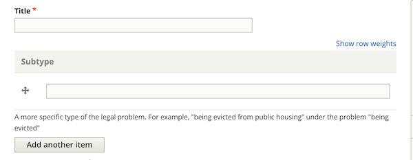
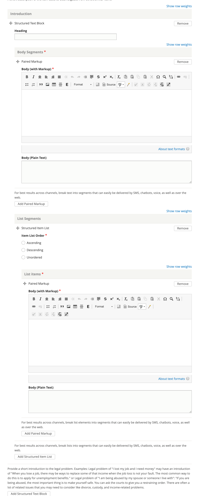
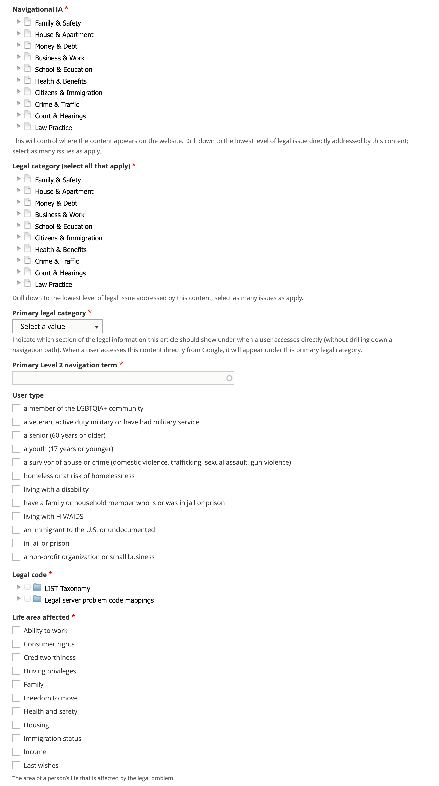
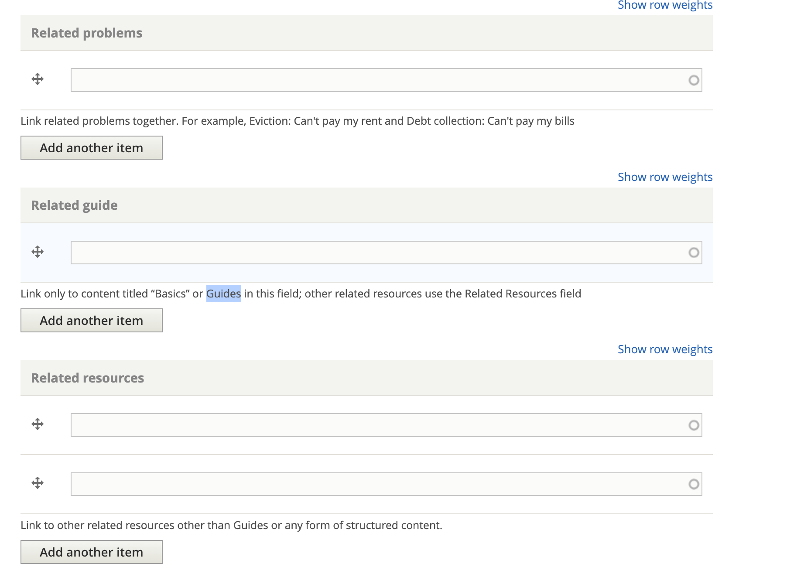

.. _cms-legal-problem:

=============================
Creating DIY Legal Solution
=============================

A DIY Legal Solution is the top-level container for structured content. The DIY Legal Solution describes a specific problem and the options for potentially dealing with the problem. All other types of structured content, except for legal questions, ultimately relate back to one or more legal problems.

Provide a title and subtype
==============================

Add a title that complies with the style guide.

You should also add a subtype. This is not currently viewable to users but in a future iteration, we may want to combine DIY legal problems with the same title and then allow the user to pick by sub-type.

Current version example:
-------------------------
Example title: I am being evicted for not paying rent

Example subtype: because I didn't pay the rent

Example title: I am being evicted because the lease ended

Example subtype: because the lease ended

Future version example:
--------------------------

Example title: I am being evicted

Example subtype: because I didn't pay the rent

Example title: I am being evicted

Example subtype: because the lease ended

Provide descriptions
======================

Provide content and meta-descriptions that comply with the style guide. Remember that these should be user-centric.

Example: From negotiating with your landlord to going to court, you have options if you are being evicted.

Draft introduction
======================
The purpose of the introduction is to provide a basic overview of the problem. It should be enough to entice the user to stay on the page and navigate through but should not duplicate information in the solution, how-tos, or questions.

The introduction may:

* Have a header
* Have one or more paragraphs
* Have one or more lists

Tag the DIY Legal Solution to specific taxonomies
====================================================

* Tag the legal problem to one or more navigational IA tags. This is used to manage the drill down.
* Tag the legal problem to one or more legal issues. This is used to associate with Get Legal Help tools.
* Select the primary legal category. This is used to keep the information organized when it is tagged to multiple primary categories (for example, we may tag a criminal records issue to Business & Work and Crime & Traffic).
* Select the primary level 2 navigation term. This is used to help with breadcrumbs, reporting, and Guided Navigation. This single term comes from the navigational IA taxonomy.
* Add a legal code. Legal codes should come from either the LSC problem codes or the `LIST <https://taxonomy.legal>`_ codes, or both.
* Add at least one life area affected. This is an `ILAO-hosted taxonomy <https://www.illinoislegalaid.org/admin/structure/taxonomy_manager/voc/life_areas>`_.

Include possible solutions and prevention options
==================================================

Add one or more possible legal options to solve the problem. This is just a reference to an existing Legal Options (see the :ref:`cms-legal-solution` documentation).

.. image:: ../assets/diy_solution_options.png

Optionally, add up to 2 preventative solutions. A preventative solution should help the user avoid the problem. For example, if the legal problem is I am being evicted, a preventative solution may be to cure a late rent payment.

Link to frequently asked questions
====================================

You can link to existing Legal Questions in the Frequently asked questions block. See the authoring guide for best practices.

.. image:: ../assets/diy_legal_solution_question.png

Link to related content
==========================

You can also add references to:

* Other legal problems that relate to this legal problem or that a user who has this problem would also likely have.
* If there is a basics article (Guide), include it here as a cross-referenced resource
* Any other related content

Add additional metadata
^^^^^^^^^^^^^^^^^^^^^^^^^^

* Add the party type. It is rare for a legal problem to be neutral
* Add an image; this will be used in social media sharing
* Optionally, add any content management tags
* Indicate whether a translation should be requested.
* Indicate whether an existing translation should be marked as outdated.
* The word count will be automatically added

