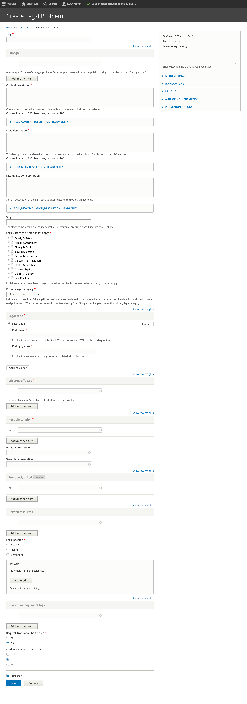

.. _cms-legal-problem:

=========================
Legal Problem
=========================

A Legal Problem is the top-level container for structured content. All other types of structured content are relate back to one or more legal problems (although depending on the use case, one could render the other elements separately).

.. note::  Fields should comply with our content style guide.

To create a legal problem:

* Add a title. This should describe the problem to be solved or prevented using the embedded solutions.
* Add a subtype. This should describe any subcategory of a problem.
* Add a content description. This is the description that will
* Add a meta description. This is the description that will be used in social media, search indexes, and in any API. This should be limited to 300 characters.
* Optionally, add a disambiguation description. This is used to better describe how one problem is different from a related problem.
* Add an introduction as structured markup.  The purpose of the introduction is to provide a basic overview of the problem and available solutions. It should be enough to entice the user to stay on the page and navigate through but should not duplicate information in the solution, how-tos, or questions.
* Tag the legal problem to one or more legal issues.
* Select the primary legal category
* Add a legal code. Legal codes should come from either the LSC problem codes or the `LIST <https://taxonomy.legal>`_ codes.

The above image includes the legal code for Food stamps from both the LSC problem codes and LIST.

.. note::  Ideally, we would update this to use a taxonomy.

* Add at least one life area affected. This is an `ILAO-hosted taxonomy <https://www.illinoislegalaid.org/admin/structure/taxonomy_manager/voc/life_areas>`_.

* Add one or more possible solutions to solve the problem. This is just a reference to an existing Legal Solution (see the :ref:`cms-legal-solution` documentation).
* Optionally, add up to 2 preventative solutions. A preventative solution should help the user avoid the problem. For example, if the legal problem is I am being evicted, a preventative solution may be to cure a late rent payment.
* Optionally, add a FAQ by adding individual Legal Questions. This is just a reference to an existing Legal Question (see the Legal Question documentation).
* Optionally, add one or more related resources by adding individual pieces of legal content. This is just a reference to an existing Legal content, portal main pages, and toolbox content.

.. note::  We envision that the API will automatically pull in data about related resources, such as last revised dates and content format.

* Optionally, add any content management tags
* Indicate whether a translation should be requested.
* Indicate whether an existing translation should be marked as outdated.

.. note:: A legal problem itself contains no real content. It is a container for other content. As such, it does not have the last reviewed/revised dates that other content types have. It will inherit the oldest reviewed/revised dates from its child components.

Legal problems, subtypes, disambiguation descriptions, and solutions
======================================================================

Legal problems are generally broad. "I am losing my rental housing" or "I am being abused" are legal problems.

Subtypes are narrower types of problems within a legal problem.

A disambiguation description distinguishes between problems and subtypes.

A solution describes the solution for solving the problem/subtype pair.

Examples
--------------------------
Problem:  I am at risk of losing my rental housing
^^^^^^^^^^^^^^^^^^^^^^^^^^^^^^^^^^^^^^^^^^^^^^^^^^^

* Subtype 1: Being evicted from an unsubsidized apartment, with a disambiguation description of "This applies when the tenant is not using a housing voucher and/or their rent is not based on their income."
* Subtype 2: Being evicted from a subsidized apartment, with a disambiguation description of "This applies when the tenant isusing a housing voucher and/or their rent is not based on their income but is not in public housing."
* Subtype 3: Being evicted from a public housing unit
* Subtype 4: Being evicted from a unit in foreclosure.

Problem:  I am being abused
^^^^^^^^^^^^^^^^^^^^^^^^^^^^^

* Subtype 1: Being abused by a spouse or someone you live with
* Subtype 2: Being abused by someone who is or was a romantic partner but who doesn't live with you.
* Subtype 2: Survivor of sexual abuse or assault
* Subtype 3: Being stalked
* Subtype 4: Being abused by an adult child
* Subtype 5: Being abused by a parent

Solutions for each of these may include:

* Getting an order of protection
* Getting a civil no contact order
* Getting a stalking no contact order
* Changing an order of protection
* Changing a civil no contact order
* Changing a stalking no contact order
* Renewing an order of protection
* Renewing a civil no contact order
* Renewing a stalking no contact order

and the subtypes may share the solutions.

Life areas affected
======================

As of January 2021, the terms include:

  * Ability to work
  * Consumer rights
  * Creditworthiness
  * Driving privileges
  * Family
  * Freedom to move
  * Health and safety
  * Housing
  * Immigration status
  * Income
  * Last wishes

Frequently Asked Questions
===========================
Legal problems can have Legal Questions attached. FAQs should address the problem directly. General questions related to solutions should be added to the Legal Solution but questions specifically related to how the solution affects the problem should go here. For example: When am I eligible for a second bankruptcy? would go in the bankruptcy solution but Can I save my house if I file for bankruptcy would go in a foreclosure-related problem.

Legal Question vs Related Resource
====================================

A Legal Question is a piece of structured content that answers a specific question relevant to a problem or solution.

Related resources are pieces of legal content that are not transformable into a Question/Answer (for example, a video or flowchart) or are more tangential to a specific problem or solution.

Examples of good Legal Questions attached to Applying for unemployment

* Can I get unemployment if I work part-time?
* Can I get unemployment if I was fired for cause?

Examples of good related resources that might be attached to applying for unemployment:

* Unemployed parents and paying child support
* Calculating unemployment benefits

Full add/edit form
====================

