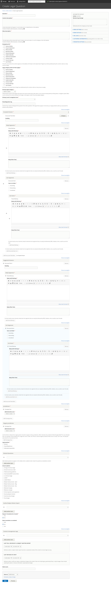

.. _cms-legal-question:

======================
Legal Question
======================

Legal questions can potentially "stand alone" or be part of a larger FAQ within a specific  DIY Legal Solution packet or attached to a specific legal solution.

Creating a legal question
==============================

Create the core problem information
^^^^^^^^^^^^^^^^^^^^^^^^^^^^^^^^^^^^

* Add the Question title. The title should be drafted as a question.
* Add a content description. This is the description that will be used if the question is displayed independently on our website.
* Add a meta description. This is the description that will be used in social media, search indexes, and in any API. This should be limited to 300 characters.

Categorize the legal problem
^^^^^^^^^^^^^^^^^^^^^^^^^^^^^

* Tag the legal problem to one or more navigational IA tags. This is used to manage the drill down.
* Tag the legal problem to one or more legal issues. This is used to associate with Get Legal Help tools.
* Select the primary legal category. This is used to keep the information organized when it is tagged to multiple primary categories (for example, we may tag a criminal records issue to Business & Work and Crime & Traffic).
* Select the primary level 2 navigation term. This is used to help with breadcrumbs, reporting, and Guided Navigation. This single term comes from the navigational IA taxonomy.
* Optionally add a disambiguation tag to distinguish between similar questions. For example, What is the fee to file? may be a question for bankruptcy cases, small claims, and name changes but the answer varies depending on the case type.

Create the answer
^^^^^^^^^^^^^^^^^^^^
* Add the Answer as the Accepted Answer. An accepted answer uses the :ref:`cms-structured-text` block.

.. note::  Answers should be broken into segments, either paired markup or list items to avoid having to deliver large blocks of text over non-web interfaces. Web interfaces can concatenate segments back together.

* Optionally add one or more suggested answers. Suggested answers can be used when there is an official answer but there may be additional options. This is rarely used in our legal content.

* Add a jurisdiction for the question. See :ref:`cms-coverage-area` documentation.

.. note:: By adding jurisdictions to questions, we can offer location-specific answers. For example, in answering "Can I deduct a repair cost?," the answer may be different in Chicago than in Naperville. When included in an Illinois problem of "My landlord won't fix my bathroom," we can deliver the right Legal Questions to the right users based on location.

Add related questions
^^^^^^^^^^^^^^^^^^^^^^

.. note:: waiting on content team decisions

Add additional metadata
^^^^^^^^^^^^^^^^^^^^^^^^^^

* Add the legal position associated with the question.
* Tag the legal question to annual updates.
* Optionally, add an author/SME to the question
* Indicate whether a translation should be requested.
* Indicate whether an existing transation should be marked as outdated.
* Optionally, add any content management tags
* Set the last reviewed and last revised date per content policy.

Legal Question vs Related Resource
=====================================

Not all of our legal content needs to be "transformed" into questions. Some information, particularly those that are videos, flowcharts, decision trees that would be better suited as articles can stay that way and be linked to as Related Resources

Related Questions
====================

On the sidebar when viewed in a web browser, related questions can appear. There is a related question field that allows one to group legal questions together.

.. note:: Can we or should we write a query to return related questions where the question being viewed is in a related question field OR when the question being viewed has related questions to prevent the need to add related questions to every question.

Legal Questions in Problems vs Legal Questions in Solutions
=============================================================

Full add/edit form
====================

