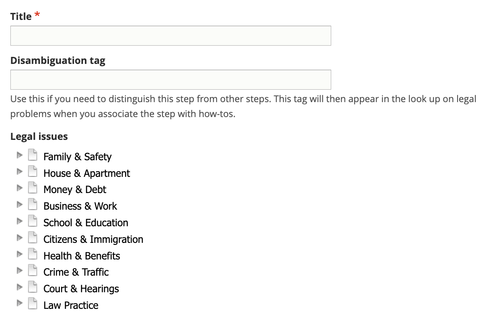
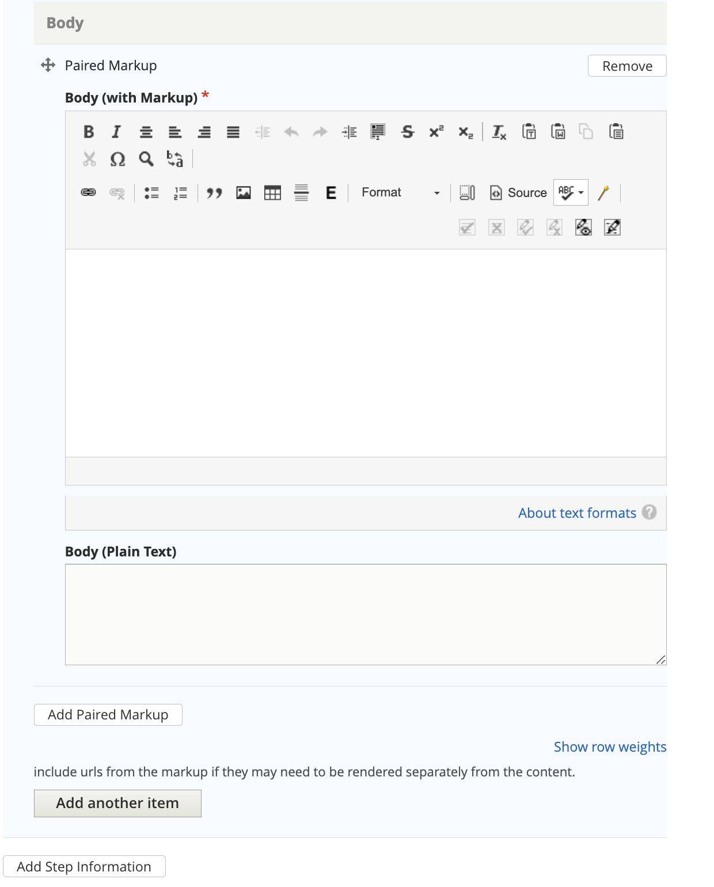

.. _cms-legal-step:

======================
Creating Legal Step
======================

Legal steps are part of a :ref:`cms-legal-howto` which are part of a :ref:`cms-legal-solution`.

A step is composed of 1 or more directions and 0 or more tips.

.. note:: Legal steps can be re-used in multiple how-tos.

Style notes
==================

Not directly accessible
-------------------------

Individual steps are not indvidually accessible from navigation or search. As such, they do not have the following fields:

* Content description
* Metatag description
* Navigational IA tags

Direction vs. Tip
-----------------------

A direction is "A direction indicating a **single** action to do in the instructions for how to achieve a result."

A tip is "An explanation in the instructions for how to achieve a result. It provides supplementary information about a technique, supply, author's preference, etc. It can explain what could be done, or what should not be done, but doesn't specify what should be done."  What should be done is a direction.

For example, the step "Move out and clean the apartment" might have:

* a Direction of "Move all of your items from the unit."
* a Direction of "Clean the unit thoroughly"
* a Tip of "This includes all floors and surfaces, the refrigerator, the freezer, the oven, and all bathrooms."
* a Direction of "Check the written lease, if there is one, to make sure you have followed all of the instructions for moving out."

.. note:: We are adding an ability to indicate whether to display a tip in-line or called out. This will alleviate some of the style concerns on the website over tips interrupting page flow

Bulleted lists
------------------
The list item format is not supported in step content. It is okay to use bulleted lists in the body (with markup) when needed, so long as the list items are not directions or tips in and of themselves.

Return all of the keys to the landlord right after you move. If you do not, the landlord may charge you. If you return the keys to a leasing office, have the landlord write up a receipt acknowledging that the keys have been returned. If you are returning keys by mail, send the keys with a tracking number and keep that tracking number for your records.

This could be structured as:

* A Direction of "Return all of the keys to the landlord right after you move."
* A Tip of "If you do not, the landlord may charge you."
* A Direction of "Get proof that you returned the keys."
* A Tip with 2 body elements of "If you return the keys to a leasing office, have the landlord write up a receipt acknowledging that the keys have been returned."and "If you are returning keys by mail, send the keys with a tracking number and keep that tracking number for your records."

This might render on the web as:

1. Return all of the keys to the landlord right after you move. If you do not, the landlord may charge you.
2. Get proof that you returned the keys. If you return the keys to a leasing office, have the landlord write up a receipt acknowledging that the keys have been returned. If you are returning keys by mail, send the keys with a tracking number and keep that tracking number for your records.

and over SMS may be:

* Segment 1:  Return all of the keys to the landlord right after you move.
* Segment 2:  Tip:  If you do not, the landlord may charge you. Reply N for the next direction
* Segment 3:  Get proof that you returned the keys.
* Segment 4:  Tip:  If you return the keys to a leasing office, have the landlord write up a receipt acknowledging that the keys have been returned.
* If you are returning keys by mail, send the keys with a tracking number and keep that tracking number for your records.

Legal forms needed
====================

Steps may have one or more legal forms attached to them.  For example, the step "Complete a motion" may have the direction of "You will need to complete a motion form" and also link to the motion form(s) in Legal forms needed.

Jurisdiction
==============
Individual steps may be tagged to a specific jurisdiction. When attached to a how-to, the correct steps will display for the specific user's location.

For example, a "How-to" with a jurisdiction of Illinois may have 10 steps; 9 are tagged to Illinois but 1 is tagged to Cook county. A user in Kane county would see 9 steps; a user in Cook county would see 10 steps.

The order of the steps would depend on the How-to.

Creating or editing a step
============================

Create title and tags
------------------------

The title should be actionable as this will be the heading displayed for the step. For example:

* File your forms
* Fill out your forms
* Make 6 copies
* Serve the landlord

Because many steps may have the same title, use the disambiguation tag to differentiate one step from another. This will be helpful in content re-use. For example, file your forms steps may have disambiguation tags of:

* Eviction, landlord, Cook County
* Eviction, tenant, Cook County
* Eviction, tenant, everywhere but Cook County
* Divorce, petitioner, statewide
* Divorce, respondent

Create the actual step content
--------------------------------

.. note::  How-to content allow steps to be grouped together.

A  step block consists of:

* a type (direction or tip)
* one or more body elements, using :ref:`cms-paired-markup`. Using multiple body elements allows us to better segment content over non-web channels.

A step can (and likely will) have more than one step block.

.. note:: We are adding a field to indicate how a step information segment should be rendered when the type is a tip. The options will be plain text or as highlight. This will allow us to have tips that do not disrupt the text flow on the web interface.

Link to Legal Forms if needed
-------------------------------

Steps may have one or more legal forms attached to them.  For example, the step "Complete a motion" may have the direction of "You will need to complete a motion form" and also link to the motion form(s) in Legal forms needed.

Legal Forms are special content type that needs to be created first including them.

.. image ../assets/cms-legal-forms-step.png

Add the jurisdiction information
----------------------------------

Every step should be tagged to a jurisdiction. A step may also be excluded from a jurisdiction. When displayed in a Legal Option or How-To, steps will be displayed to show the user the correct jurisdiction or will be organized by jurisdiction.

.. image:: ../assets/cms-step-jurisdiction.png

Example 1: The Fight an eviction how-to has these steps attached to it, in this order:

* Fill out your forms (Statewide)
* File your forms (Cook County)
* File your forms (All but Cook County)
* Ask for ERP help (Cook County)
* Go to court (Statewide)

On the website, the user will see:

* Step 1: Fill out your forms
* Step 2: File your forms

 * If you are in Cook County....
 *  If you are anywhere else in Illinois...

* Step 3: In Cook County only, ask for ERP help
* Step 4: Go to court

Over SMS, the user has told us they are in Cook County:

* Step 1: Fill out your forms
* Step 2: File your forms (Cook county version)
* Step 3: Ask for ERP Help
* Step 4: Go to court

Add citation(s)
----------------

Add any applicable citations to the step.

Add editorial metadata
========================

.. note:: we are in the process of reordering and adding the date fields.

Add or update any editorial fields. This includes:

* Author/SME
* Editorial notes
* Mark translation as outdated
* Translation type
* Translation status
* Last full review by SME date
* Last revised by staff date

Word count will be automatically added.

