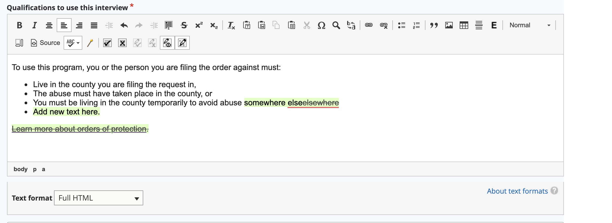

========================
Track changes
========================

We use the `Lite plugin <https://www.loopindex.com/lite/doc/>`_ for Ckeditor 4 to track changes within the WYSIWYG.

* Tracking changes is turned off by default. Because the bulk of our content editing is done by staff, we have set them to be off by default.
* When turned on, tracking changes will capture changes made by the user.
* When content has unapproved tracked changes in it:

  * Those changes will not be visible in the WYSIWYG unless show track changes is turned on.
  * Those changes will not be visible in the content.

.. warning:: It is important when reviewing content from outside editors, who are instructed to use track changes, to turn on both start tracking and show track changes and approve/reject changes before publishing. This is the only way to see if there are incomplete revisions.

There are 6 buttons on the track changes toolbar:

.. image:: ../assets/track-changes-toolbar.png

They are (from left to right)

* Approve all
* Reject all
* Approve change
* Reject change
* Toggle show/hide track changes
* Toggle start/stop tracking changes.

When track changes is turned on, additions and deletions will be tracked. If show tracked changes is turned on, they will appear:

If show track changes is turned off, the tracked changes will not appear:

And end users may see no changes or weird changes:

.. image:: ../assets/open-tracked-changes.png

The source code will show a bunch of data tags:

.. image:: ../assets/track-changes-source.png

.. note:: If start tracking changes is turned on, a warning will appear if you attempt to turn them off without approving or rejecting tracked changes.

