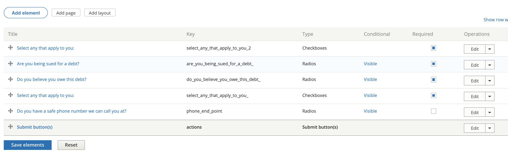
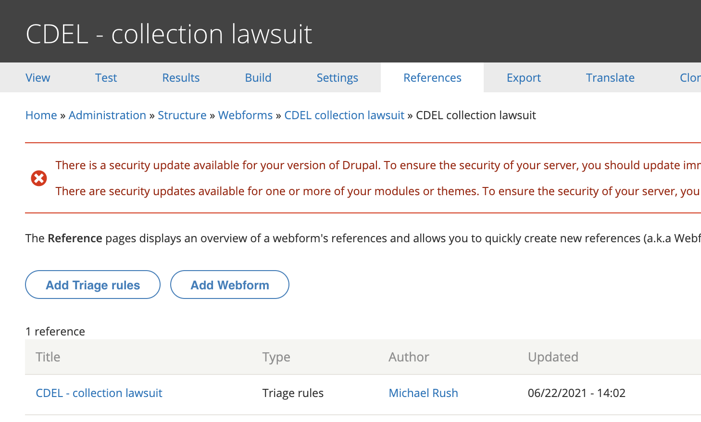

============================
Webforms in legal content
============================

Webforms can be created an embedded within legal content.  Existing examples include:

.. note:: Currently, webforms can only be embedded in portal main page content and toolbox steps.

* `Are you a victim? <https://www.illinoislegalaid.org/voc/are-you-victim-or-survivor-crime>`_ on VOCA

Creating a webform for legal content
======================================

* Go to Structure => Webform and Add webform
* Enter a title that complies with our style guidelines in the title
* Set the category to Legal Content

.. image:: ../assets/webform-add-lc.png

* Go to Build and build your form.  See `Drupal's webform documentation <https://www.drupal.org/docs/8/modules/webform/webform-features>`_ for general information on how to build a webform.

* Go to test or view to test your webform. If you use view, any data will be stored as a webform submission.

* Go to reference and create a webform node to attache your webform too.

Adding to legal content
=========================

To add to portal main page:

* Add the paragraph bundle "portal layout webform"
* Provide a title for the webform.
* Add a summary.  This is a place to provide text for the user to understand the form.
* Select the webform from the dropdown.

.. image:: ../assets/lc-webform-portal-page.png

.. todo:: Add support for webforms embedded in legal content.

To add to tool step content:

* Add the paragraph bundle "Webform"
* Optionally, provide a title for the webform.
* Optionally, add a summary.  This is a place to provide text for the user to understand the form.
* Select the webform from the dropdown.

