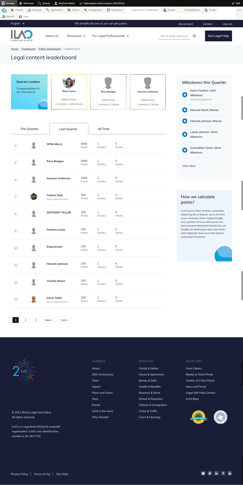

====================
LCV Leaderboards
====================

There are three leaderboards:

* Overall individual leaderboard
* Organization leaderboard (in development)
* Organization editor leaderboard (in development)

Content editor leaderboard
============================

The content editor leaderboard shows standings for the current quarter, last quarter, and all time. Changing the toggle in the leaderboard will update the Quarter leaders and the overall standings.

Quarter Leaders
-----------------

Quarter leaders are the top point earners during the selected quarter (current, last quarter, all time).

Listings
-----------
Listings show all point earner and includes:

* Their rank
* Their photo, if uploaded
* Their name
* The total number of points earned during the period
* The total number of articles revised during the period
* The total number of words edited during the period

The listing will:

* Default to the current quarter
* Defaults to the page the user appears on
* Has a link to the user's dashboard and organization leaderboard next to their record in the listing.

Milestones this quarter
-------------------------

This block shows the most recent milestones awarded. The more link goes to an overflow page that shows all milestones awarded.

