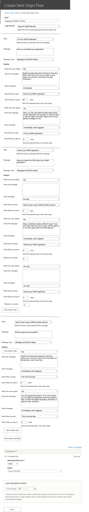

===============================
Next Steps Flow Content Type
===============================

The Next Steps Flow content type is where ILAO staff can create a specific flow for a specific Legal How-to.

A Next Steps Flow must be attached to a single How-to. Once the How-to is selected, a staff member can create messages attached to 1 or more steps.

A message component is triggered when:

* A caseworker marks the step complete in LegalServer and subscribes the user to messages
* A different step is marked complete AND an appropriate reply to that step was received that scheduled this step to send.

For example, in the above example, the step "Submit your SNAP application" will be triggered:

* immediately, if a caseworker selects that in LegalServer
* 6 days after the Submit your SNAP applciation is triggered and the user replies "No"
* 30 days after the Fill out a SNAP application is triggered and the user replies "Yes"
* 2 days after the Submit your SNAP application is triggered and the user does not reply.

.. note:: For reply processing that sends a message, that message will have a maximum number of retries. For example, using the attached:

* If a user replies No to the submit their application question, the question will resend in 6 days. If the user replies No again, it will send one more time in 6 days. If the user still replies No, it will stop.

* If a user does not reply to the submit their application question, the question will resend up to 2 more times. If the user never replies, they are treated as discontinued. If they reply Yes or No, those replies will kick in.

+------------------------------+----------------------------------+--------------------+
| Field                        | Description                      |  Type              |
+==============================+==================================+====================+
| Title                        | Title for the flow               | Title              |
+------------------------------+----------------------------------+--------------------+
| Legal How-to                 | Single select for the associated | Entity reference   |
|                              | legal how-to content type        |                    |
+------------------------------+----------------------------------+--------------------+
| Next Step Component          | Container for a specific next    | Paragraphs;        |
|                              | step                             | unlimited          |
+------------------------------+----------------------------------+--------------------+

Next Step Component
=======================

The next step component contains the triggering step, initial message and handling for replies.

+------------------------------+----------------------------------+--------------------+
| Field                        | Description                      |  Type              |
+==============================+==================================+====================+
| Step                         | Single select for the associated | Entity reference   |
|                              | steps in the how-to              |                    |
+------------------------------+----------------------------------+--------------------+
| Initial message              | Message to send when triggered   | Paired Markup      |
|                              |                                  | unlimited          |
+------------------------------+----------------------------------+--------------------+
| Message type                 | Single select - Message and wait | Select             |
|                              | for reply OR message             |                    |
+------------------------------+----------------------------------+--------------------+
| Replies                      | Container for processing replies | Paragraphs;        |
|                              |                                  | unlimited          |
+------------------------------+----------------------------------+--------------------+

Replies
============

Replies live within the Next Step Component and are designed to store information for processing a reply and determining next steps.

+------------------------------+----------------------------------+--------------------+
| Field                        | Description                      |  Type              |
+==============================+==================================+====================+
| When the user replies        | Single select                    | Term reference     |
+------------------------------+----------------------------------+--------------------+
| Send this message            | Text of follow up                | Paired markup      |
+------------------------------+----------------------------------+--------------------+
| Send message                 | Single select (immediately or    | List               |
|                              | time from trigger or no reply)   |                    |
+------------------------------+----------------------------------+--------------------+
| Last step                    | Indicate if this is the last     | Boolean            |
|                              | or not                           |                    |
+------------------------------+----------------------------------+--------------------+
| Time from trigger            | Number of days to send when      | Number             |
|                              | Send message is set time         |                    |
+------------------------------+----------------------------------+--------------------+
| Next follow up step          | Single select of availalbe       | Entity reference   |
|                              | steps                            |                    |
+------------------------------+----------------------------------+--------------------+
| Send follow-up step in       | Number of days to send follow    | Number             |
|                              | up step                          |                    |
+------------------------------+----------------------------------+--------------------+

When the user replies
------------------------

This is a term reference to the SMS replies taxonomy. This taxonomy contains:

* Name
* Alternative names

This allows us to check fro various ways a user might reply (for example, for Yes: Yes, Y, Yeah, Yep, etc).

Two additional terms will be added:

* No match (the user replies but there is no match)
* No reply (for users who do not reply)

Send message options
----------------------

Sending a reply to message sent can be scheduled:

* Immediately
* In a specified number of days
* No reply (for when no immediate follow up is required).

