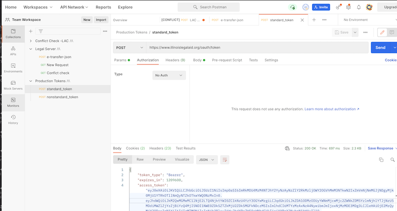
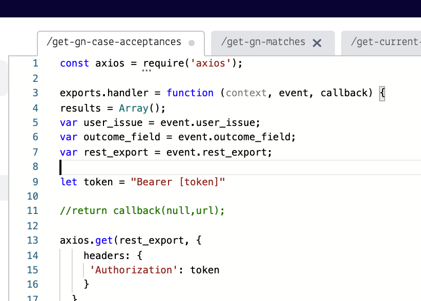

============================
Twilio token updates
============================
At the current time, we need to manually update the bearer tokens in Twilio functions.

Standard Token
================
You can get the standard token using the standard token request in Postman.

ILAO service
--------------

* pilot-get-callback-slots
* pilot-get-organization-names
* pilot-get-intake-settings
* pilot-get-matches
* otis-update-triage-user
* otis-create-triage-user
* eviction-matches
* eviction-intake-settings

Guided-nav service
-------------------

* get-gn-case-acceptances

Nonstandard token
==================
The get-gn-matches in the Guided Nav service requires the nonstandard token. You can get the non-standard token using the non-standard token request in Postman.

How to update
===============

* Go to the team workspace in Postman

* Open the Production token collection and run both functions. Copy and paste the access token into each Twilio function, replacing the [token] in token = "Bearer [token]" with the actual access token.

