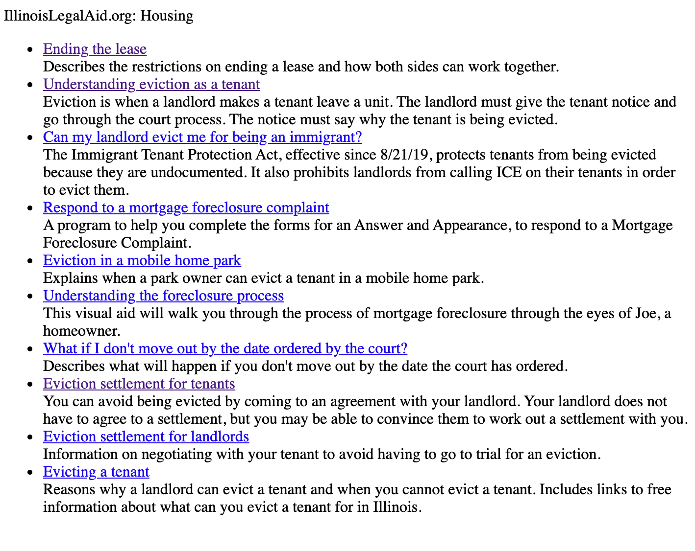

RSS Feeds
=============
To use these feeds as is, copy the full code block and paste into your website.  Or, you can access the raw RSS file and create your own version.

Sample output
=================

Each feed shows 10 hand-curated pieces of legal information in the selected categories.  The feeds were generated using `feed2js.org <http://feed2js.org>`_.

Customizing the look and feel
-------------------------------
The output is contained in a div with a class of rss-box.  
The feed title has a class of rss-title.
Each item is a list element with a class of rss-item.  

Websites can use standard CSS to customize these items.  See `Feed2JS's Style information <https://feed2js.org/style.php>`_.

There is also a set of predefined styles that you can experiment with and copy and paste the CSS into your website.

Family content
===================

Raw RSS feed:  `Family RSS <https://www.illinoislegalaid.org/legal-information/housing.rss>`_

.. code-block:: HTML

   

   <noscript>
   <a    href="http://feed2js.org//feed2js.php?src=https%3A%2F%2Fwww.illinoislegalaid.org%2Flegal-information%2Ffamily.rss&chan=titlelinkno&desc=1&utf=y&html=n">View RSS feed</a>
   </noscript>

Housing content
===================

Raw RSS feed:  `Housing RSS <https://www.illinoislegalaid.org/legal-information/housing.rss>`_

.. code-block:: HTML

   

   <noscript>
   <a href="http://feed2js.org//feed2js.php?src=https%3A%2F%2Fwww.illinoislegalaid.org%2Flegal-information%2Fhousing.rss&chan=titlelinkno&desc=1&utf=y&html=y">View RSS feed</a>
  </noscript>

Safety
===============
Raw RSS feed: `Safety RSS <https://www.illinoislegalaid.org/legal-information/safety.rss>`_

.. code-block:: HTML

   

   <noscript>
   <a href="http://feed2js.org//feed2js.php?src=https%3A%2F%2Fwww.illinoislegalaid.org%2Flegal-information%2Fsafety.rss&chan=titlelinkno&desc=1&utf=y&html=y">View RSS feed</a>
   </noscript>

Small Claims
==============

Raw RSS feed: `Small Claims RSS <https://www.illinoislegalaid.org/legal-information/smallclaims.rss>`_

.. code-block:: HTML

   

   <noscript>
   <a href="http://feed2js.org//feed2js.php?src=https%3A%2F%2Fwww.illinoislegalaid.org%2Flegal-information%2Fsmallclaims.rss&chan=titlelinkno&desc=1&utf=y&html=y">View RSS feed</a>
   </noscript>

Traffic
==========
Raw RSS feed: `Traffic RSS <https://www.illinoislegalaid.org/legal-information/traffic.rss>`_

.. code-block:: HTML

   

   <noscript>
   <a href="http://feed2js.org//feed2js.php?src=https%3A%2F%2Fwww.illinoislegalaid.org%2Flegal-information%2Ftraffic.rss&chan=titlelinkno&desc=1&utf=y&html=y">View RSS feed</a>
   </noscript>

For help, please contact support@illinoislegalaid.org. 
