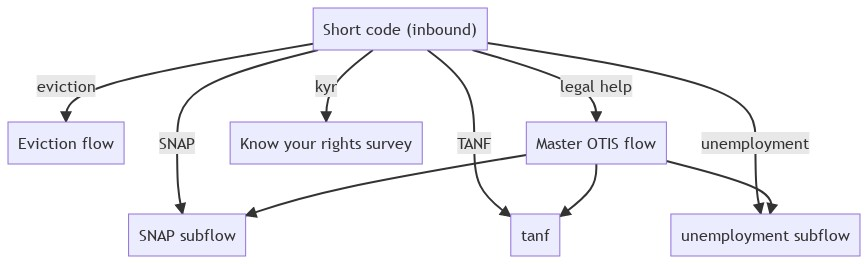
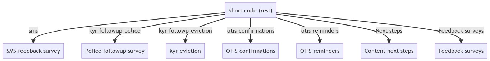

==================
SMS Overview
==================

We deliver many things over SMS. As of January 2022, we are in the process of applying for a short code that will serve as a master landing spot for all of our SMS transactions. When this is implemented, the short code will route traffic as indicated below.

Inbound messaging
===================
Inbound messaging relies on a keyword being texted to the number and then routed correctly.

The core function of the short code for inbound messaging will be to route people into OTIS. We currently have 4 defined flows: OTIS-english, OTIS-spanish, Eviction-english, Eviction-spanish.

+-----------------------+--------------------------------+
| Keyword               | Flow                           |
+=======================+================================+
| eviction              | Eviction Help (English)        |
+-----------------------+--------------------------------+
| desalojo              | Eviction Help (Spanish)        |
+-----------------------+--------------------------------+
| ayuda legal           | OTIS (Spanish)                 |
+-----------------------+--------------------------------+
| kyr                   | Know your rights initial survey|
+-----------------------+--------------------------------+
| All other inbound     | OTIS (English)                 |
+-----------------------+--------------------------------+

In the future, we will break the flows out within OTIS to support substantive keyword routing like the one below:

REST-based messaging
=====================

We will also use the short code to deliver system-based messages. These are sent over REST from the website or Zapier-based transactions to specific flows. Currently, we use REST for reminders, the SMS feedback survey, and Know your rights (KYR) follow up surveys.

+-----------------------+--------------------------------+------------------------+
| REST App              | Flow                           | Status                 |
+=======================+================================+========================+
| sms                   | SMS follow up survey           | Built as flow          |
+-----------------------+--------------------------------+------------------------+
| kyr follow up surveys | KYR surveys                    | Built as flow          |
+-----------------------+--------------------------------+------------------------+
| Otis confirmations    | N/A                            | Built in code          |
+-----------------------+--------------------------------+------------------------+
| OTIS reminders        | Not yet built                  | In backlog             |
+-----------------------+--------------------------------+------------------------+
| Next steps from       | Not yet built                  | Not defined            |
| content               |                                |                        |
+-----------------------+--------------------------------+------------------------+
| Feedback surveys      | Not yet built                  | Not defined            |
+-----------------------+--------------------------------+------------------------+

.. note:: The built in code will need to be migrated to a flow to be handled correctly.

This is the envisioned RESt system:

Mermaid code for images
=========================

This code below can be used in a Mermaid editor to create new images.

.. code-block::

   graph TD
   sc["Short code (inbound)"] -->|eviction| ev
   ev["Eviction flow"]
   sc --> |"legal help"| otis
   otis["Master OTIS flow"]
   sc -->|SNAP| snap
   otis --> snap
   snap["SNAP subflow"]
   sc -->|TANF| tanf
   otis --> tanf
   unemployment["unemployment subflow"]
   sc -->|unemployment| unemployment
   otis --> unemployment
   unemployment["unemployment subflow"]
   sc --> |kyr| kyr
   kyr["Know your rights survey"]

   graph TD
   sc["Short code (rest)"] -->|sms| ev
   ev["SMS feedback survey"]
   sc --> |kyr-followup-police| kyr-police
   kyr-police["Police followup survey"]
   sc --> |kyr-followp-eviction| kyr-eviction
   sc --> |otis-confirmations| otisc
   sc --> |otis-reminders| otisr
   otisr["OTIS reminders"]
   otisc["OTIS confirmations"]
   nextsteps["Content next steps"]
   sc --> |"Next steps"| nextsteps
   fb["Feedback surveys"]
   sc --> |Feedback surveys| fb
