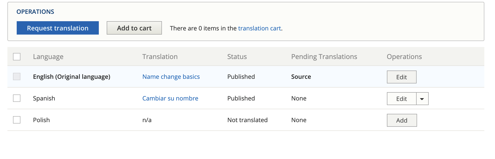
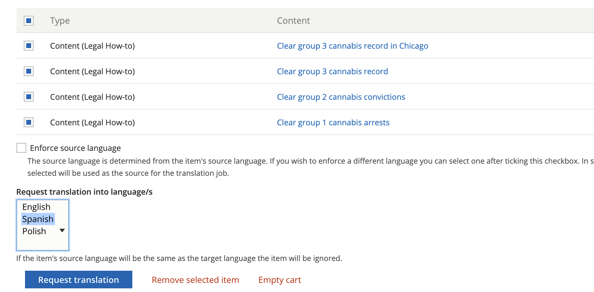
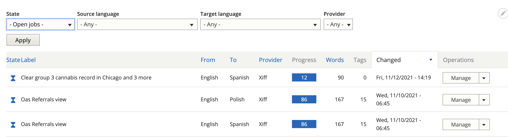

============================
Content Translation
============================

Content translation includes:

* Content types, like legal content, basic pages, organizations, locations, and services.
* Blocks, like the banner on the top of pages

In node translation
=========================

Content can be translated by clicking the "Translate" link on the edit page or when viewing the content and clicking Add to create a new translation or Edit to edit an existing translation under Operations

In the image above, there is a Spanish translation that can be edited. A Polish translation would need to be added.

Shared fields
------------------

Shared fields are those that are shared across languages. For example, the legal issues taxonomy on legal content are the same regardless of language so the field to tag content to legal issue is shared across all languages - a change in one language affects all languages.

For some content types, like legal content, fields that are shared are only visible on English content.

For other types of content, where conditional fields or paragraphs cause issues with hiding shared fields, the fields are visible but have an (all languages) label.

.. image:: ../assets/translation-all-languages.png

Using the translation management system
===========================================

The translation management system can be used to import and export content for translation. This can be done:

* Directly in content, by clicking translate and add to cart or request translation
* Using `sources <https://www.illinoislegalaid.org/admin/tmgmt/sources>`_ under the Translation menu.

.. image:: ../assets/translation-sources.png

Using source, you can:

* Filter on a source type. The source type for content items is content. Blocks can also be accessed here.
* Filter by Content type
* Check the nodes you want to add to cart (you do have to page through all pages)

Checking out a cart
---------------------
To check out a cart, select the language(s) to translate to and press Request translation.

Check out a job
-------------------

You can check out a job in Xliff or HTML format. Xliff is usable with POeditor and many translation systems. Check the job out by pressing "Submit to provider" This will then show a file can be downloaded here message.

Importing a file
-------------------

Translations are in jobs that can then be imported back in by selecting Manage next to the job on the `Jobs <https://www.illinoislegalaid.org/admin/tmgmt/jobs>`_ tab.

This will show a list of content in the job and a space to import a translated file. Once a file is imported, each content needs to be reviewed.

.. image:: ../assets/translation-job-details.png

Reviewing content
-------------------

Pressing review next to an item will show a page with all of the translatable fields.

* Press the check next to a translation to approve it
* You can change the text if it is incorrect
* You can save and return
* You can save as completed. This is true even if yu do not approve all translations.

.. image:: ../assets/translation-review.png

